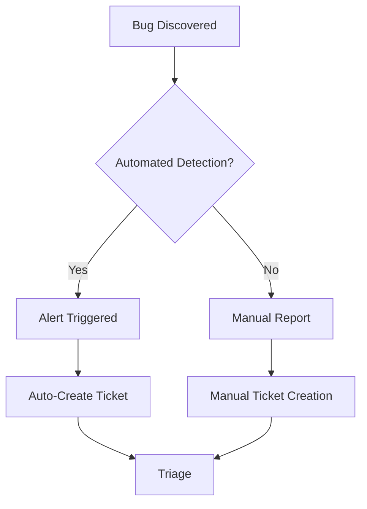

# CemAI Agents - Bug Tracking and Issue Management

## Overview
This document outlines the bug tracking process, issue management workflow, and quality assurance procedures for the CemAI Agent Swarm project.

## Bug Classification

### Severity Levels

#### P0 - Critical (Response: <30 minutes)
- **System Down**: Complete agent swarm failure
- **Safety Issue**: Commands that could damage equipment or endanger personnel
- **Data Loss**: Critical data corruption or loss
- **Security Breach**: Unauthorized access or data exposure

**Examples:**
- Guardian Agent fails to prevent quality band violation
- Egress Agent sends unauthorized commands to plant
- Authentication bypass vulnerability discovered
- AlloyDB database corruption

#### P1 - High (Response: <2 hours)
- **Major Feature Broken**: Core functionality non-operational
- **Performance Degradation**: Decision latency >120 seconds
- **Data Inconsistency**: Incorrect decisions based on bad data
- **Integration Failure**: Agent-to-agent communication broken

**Examples:**
- Optimizer Agent optimization algorithm producing invalid results
- Master Control Agent conflict resolution failing
- Vertex AI model endpoints returning errors
- A2A protocol message delivery failures

#### P2 - Medium (Response: <24 hours)
- **Minor Feature Issues**: Non-critical functionality affected
- **UI/UX Problems**: Dashboard or monitoring issues
- **Performance Issues**: Slow but functional operations
- **Documentation Errors**: Incorrect or missing documentation

**Examples:**
- Monitoring dashboard showing incorrect metrics
- API documentation inconsistencies
- Non-optimal resource utilization
- Minor configuration drift

#### P3 - Low (Response: <1 week)
- **Enhancement Requests**: Feature improvements
- **Cosmetic Issues**: UI/UX improvements
- **Code Quality**: Refactoring opportunities
- **Documentation Updates**: Non-critical documentation improvements

## Bug Lifecycle

### 1. Issue Discovery


### 2. Bug Triage Process
- **Initial Assessment**: Within 15 minutes for P0, 1 hour for P1
- **Severity Assignment**: Based on impact and urgency matrix
- **Team Assignment**: Route to appropriate development team
- **Priority Queue**: Order by business impact and technical complexity

### 3. Investigation and Resolution
```bash
# Bug investigation checklist
1. Reproduce the issue in development environment
2. Analyze logs and traces for root cause
3. Identify affected components and dependencies
4. Assess potential impact and blast radius
5. Develop fix with comprehensive testing
6. Deploy fix with rollback plan ready
```

## Issue Templates

### Bug Report Template
```markdown
## Bug Description
Brief description of the issue

## Environment
- **Agent**: Guardian/Optimizer/Master Control/Egress
- **Environment**: Development/Staging/Production
- **Version**: Agent version and commit hash
- **Timestamp**: When the issue occurred

## Steps to Reproduce
1. Step one
2. Step two
3. Step three

## Expected Behavior
What should happen

## Actual Behavior
What actually happens

## Impact Assessment
- **Business Impact**: High/Medium/Low
- **User Impact**: Number of users affected
- **System Impact**: Performance/availability impact

## Logs and Traces
```
[Include relevant log entries and trace IDs]
```

## Additional Context
Any other relevant information
```

### Feature Request Template
```markdown
## Feature Description
Brief description of the requested feature

## Business Justification
Why this feature is needed

## Acceptance Criteria
- [ ] Criterion 1
- [ ] Criterion 2
- [ ] Criterion 3

## Technical Considerations
Implementation approach and complexity

## Dependencies
Other features or systems this depends on

## Success Metrics
How success will be measured
```

## Monitoring and Alerting

### Automated Bug Detection
```yaml
# Error rate alerts
- name: "High Error Rate"
  condition: "error_rate > 1%"
  severity: "P1"
  auto_create_ticket: true

# Performance degradation
- name: "Decision Latency High"
  condition: "decision_latency > 120s"
  severity: "P1" 
  auto_create_ticket: true

# Security issues
- name: "Authentication Failures"
  condition: "auth_failures > 10/minute"
  severity: "P0"
  auto_create_ticket: true
```

### Log Analysis for Bug Detection
```python
import re
from datetime import datetime, timedelta

class BugDetector:
    def __init__(self):
        self.error_patterns = [
            r'ERROR.*(?:exception|error|failed)',
            r'CRITICAL.*(?:timeout|connection)',
            r'SECURITY.*(?:unauthorized|breach)',
        ]
    
    def analyze_logs(self, log_entries):
        """Analyze logs for potential bugs"""
        issues = []
        for entry in log_entries:
            for pattern in self.error_patterns:
                if re.search(pattern, entry, re.IGNORECASE):
                    issues.append(self.create_issue(entry))
        return issues
    
    def create_issue(self, log_entry):
        """Create issue from log entry"""
        return {
            'severity': self.determine_severity(log_entry),
            'description': self.extract_description(log_entry),
            'timestamp': datetime.utcnow(),
            'source': 'automated_detection'
        }
```

## Quality Assurance Process

### Pre-deployment Testing
```bash
# Comprehensive test suite
pytest tests/ -v --cov=agents --cov-min-percentage=90

# Security testing
bandit -r agents/ -f json -o security_report.json

# Performance testing
locust -f tests/load/test_decision_latency.py --users=100

# Integration testing
pytest tests/integration/ -v --timeout=300
```

### Post-deployment Monitoring
- **Health Checks**: Continuous agent health monitoring
- **Performance Metrics**: Real-time latency and throughput tracking
- **Business Metrics**: KPI monitoring for optimization effectiveness
- **Error Tracking**: Automatic error detection and alerting

## Bug Resolution Workflow

### Development Process
1. **Branch Creation**: `git checkout -b fix/bug-description`
2. **Fix Implementation**: Address root cause with comprehensive testing
3. **Code Review**: Peer review focusing on fix effectiveness and side effects
4. **Testing**: Comprehensive test suite including regression tests
5. **Staging Deployment**: Deploy to staging for validation
6. **Production Deployment**: Gradual rollout with monitoring

### Rollback Procedures
```bash
# Immediate rollback for critical issues
gcloud run services update-traffic SERVICE_NAME \
  --to-revisions=STABLE_VERSION=100 \
  --region=us-central1

# Database rollback (if needed)
gcloud sql backups restore BACKUP_ID \
  --restore-instance=TARGET_INSTANCE

# Configuration rollback
terraform apply -var-file=previous_config.tfvars
```

## Metrics and KPIs

### Bug Tracking Metrics
- **MTTR (Mean Time to Resolution)**: Target <2 hours for P0, <24 hours for P1
- **MTTD (Mean Time to Detection)**: Target <5 minutes for automated detection
- **Bug Recurrence Rate**: Target <5% for resolved bugs
- **Customer Impact**: Percentage of bugs affecting end users

### Quality Metrics
- **Code Coverage**: Maintain >90% test coverage
- **Defect Density**: Target <1 bug per 1000 lines of code
- **Automation Rate**: >80% of tests automated
- **Performance Regression**: Zero tolerance for performance degradation

## Communication and Escalation

### Internal Communication
- **P0 Issues**: Immediate Slack notification + phone call
- **P1 Issues**: Slack notification within 30 minutes
- **P2/P3 Issues**: Daily status updates

### External Communication
```markdown
# Customer Communication Template
Subject: CemAI Agents - Service Impact Notice

Dear Customer,

We are currently investigating an issue affecting [specific functionality].

**Impact**: [Brief description of customer impact]
**Status**: [Current status and resolution progress]  
**ETA**: [Estimated time to resolution]
**Workaround**: [Any available workarounds]

We will provide updates every [frequency] until resolved.

Best regards,
CemAI Support Team
```

### Escalation Matrix
- **Level 1**: Development Team (0-2 hours)
- **Level 2**: Team Lead (2-4 hours) 
- **Level 3**: Engineering Manager (4-8 hours)
- **Level 4**: VP Engineering (8+ hours)

## Post-Incident Analysis

### Incident Review Process
1. **Timeline Creation**: Detailed timeline of events
2. **Root Cause Analysis**: 5 whys analysis for root cause identification
3. **Impact Assessment**: Full impact analysis including business metrics
4. **Action Items**: Preventive measures and process improvements
5. **Follow-up**: Track action item completion and effectiveness

### Learning and Improvement
- **Knowledge Base Updates**: Document common issues and solutions
- **Process Refinement**: Continuous improvement of bug tracking process
- **Tool Enhancement**: Improve monitoring and detection capabilities
- **Training**: Team training on new tools and processes

This bug tracking framework ensures rapid identification, efficient resolution, and continuous improvement of the CemAI Agent Swarm system quality.
