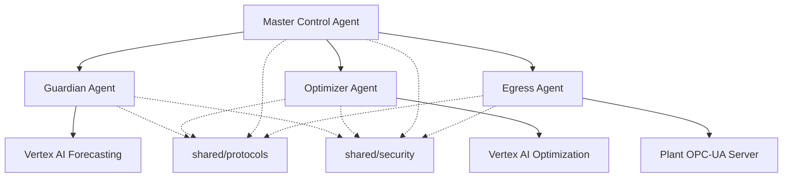
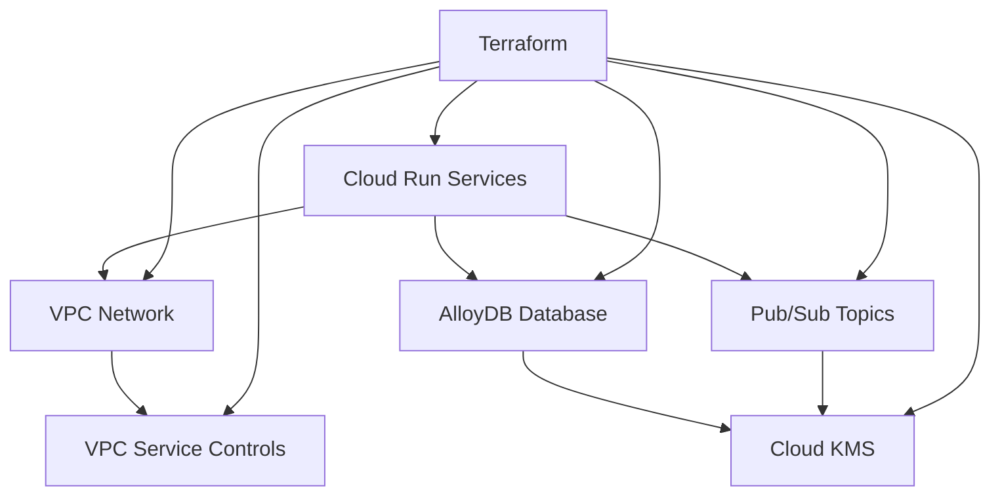

# CemAI Agents - Project Structure Documentation

## Overview
This document provides a comprehensive overview of the CemAI Agent Swarm project structure, explaining the organization, purpose, and relationships between different components of the system.

## Root Directory Structure

```
cemai-agents/
├── .cursor/                    # Cursor IDE configuration
│   └── rules/                  # AI assistant behavior rules
├── agents/                     # Individual agent implementations
├── docs/                       # Project documentation
├── infrastructure/             # Infrastructure as Code (IaC)
├── shared/                     # Shared libraries and utilities
├── tests/                      # Test suites
├── .git/                      # Git version control
├── PRD.md                     # Product Requirements Document
├── README.md                  # Project overview and setup guide
└── requirements.txt           # Python dependencies
```

## Detailed Directory Breakdown

### 📁 `.cursor/` - Development Environment Configuration
Configuration files for the Cursor AI-powered IDE to enhance development experience.

```
.cursor/
└── rules/
    ├── generate.mdc           # Code generation rules and standards
    └── workflow.mdc           # Development workflow guidelines
```

**Purpose:**
- Define AI assistant behavior for consistent code generation
- Establish development workflow standards
- Ensure code quality and architectural consistency

### 📁 `agents/` - Agent Service Implementations
Core directory containing the implementation of each intelligent agent in the swarm.

```
agents/
├── guardian/                  # Guardian Agent ("The Stabilizer")
│   ├── src/                   # Source code
│   │   ├── main.py           # FastAPI application entry point
│   │   ├── predictor.py      # ML model integration
│   │   ├── controller.py     # Control action calculation
│   │   └── proposer.py       # A2A proposal formulation
│   ├── config/               # Configuration files
│   │   ├── model_config.yaml # Vertex AI model configuration
│   │   └── quality_bands.yaml # Quality parameter limits
│   ├── Dockerfile            # Container configuration
│   ├── requirements.txt      # Agent-specific dependencies
│   └── agent_specification.md # Detailed agent specification
│
├── optimizer/                 # Optimizer Agent ("The Economist")
│   ├── src/
│   │   ├── main.py           # FastAPI application
│   │   ├── optimizer.py      # Constraint-based optimization
│   │   ├── market_monitor.py # Market data integration
│   │   └── fuel_mixer.py     # Fuel mix optimization
│   └── config/
│       └── optimization_config.yaml
│
├── master_control/            # Master Control Agent ("The Conductor")
│   ├── src/
│   │   ├── main.py           # FastAPI application
│   │   ├── orchestrator.py   # LangGraph workflow orchestration
│   │   ├── conflict_resolver.py # Conflict resolution logic
│   │   └── decision_engine.py # Constitutional AI framework
│   └── config/
│       ├── langgraph_config.yaml
│       └── constitution.yaml  # Decision-making principles
│
└── egress/                    # Egress Agent ("The Actuator")
    ├── src/
    │   ├── main.py           # FastAPI application
    │   ├── opcua_client.py   # OPC-UA communication
    │   ├── validator.py      # Command validation
    │   └── executor.py       # Command execution
    └── config/
        └── plant_config.yaml # Plant system configuration
```

**Agent Responsibilities:**
- **Guardian Agent**: Process stability monitoring and quality assurance
- **Optimizer Agent**: Cost optimization and sustainability management
- **Master Control Agent**: Swarm coordination and decision arbitration
- **Egress Agent**: Secure command transmission to plant systems

### 📁 `docs/` - Project Documentation
Comprehensive documentation covering all aspects of the project.

```
docs/
├── architecture/              # System architecture documentation
│   ├── system_architecture.md # Complete system design
│   ├── agent_interaction_flows.md
│   └── data_flow_diagrams.md
│
├── api/                       # API documentation
│   ├── a2a_protocol.md       # Agent-to-agent protocol (symlink to shared)
│   ├── rest_api_spec.yaml    # OpenAPI specifications
│   └── webhook_documentation.md
│
├── deployment/                # Deployment and operations
│   ├── deployment_guide.md   # Complete deployment instructions
│   ├── infrastructure_setup.md
│   ├── security_configuration.md
│   └── troubleshooting_guide.md
│
├── Bug_tracking.md           # Bug tracking and QA processes
├── Implementation.md         # Implementation guide
├── Project_structure.md      # This document
└── UI_UX_doc.md             # User interface documentation
```

### 📁 `infrastructure/` - Infrastructure as Code
All infrastructure configuration and deployment automation.

```
infrastructure/
├── terraform/                 # Terraform configurations
│   ├── main.tf               # Core GCP infrastructure
│   ├── variables.tf          # Configuration variables
│   ├── outputs.tf            # Infrastructure outputs
│   ├── modules/              # Reusable Terraform modules
│   │   ├── networking/       # VPC and networking module
│   │   ├── security/         # Security and IAM module
│   │   └── agents/           # Agent infrastructure module
│   └── environments/         # Environment-specific configs
│       ├── development.tfvars
│       ├── staging.tfvars
│       └── production.tfvars
│
├── cloud_run/                # Cloud Run service configurations
│   ├── guardian_agent.yaml   # Guardian service config
│   ├── optimizer_agent.yaml  # Optimizer service config
│   ├── master_control_agent.yaml
│   └── egress_agent.yaml
│
├── networking/               # Network configuration
│   ├── vpc_config.yaml       # VPC setup
│   ├── firewall_rules.yaml   # Security rules
│   └── load_balancer_config.yaml
│
├── monitoring/               # Monitoring and observability
│   ├── dashboards/           # Grafana/Cloud Monitoring dashboards
│   │   ├── executive_dashboard.json
│   │   ├── operations_dashboard.json
│   │   └── security_dashboard.json
│   ├── alerts/               # Alert policies
│   │   ├── critical_alerts.yaml
│   │   ├── performance_alerts.yaml
│   │   └── security_alerts.yaml
│   └── sla_config.yaml       # Service Level Agreements
│
└── scripts/                  # Deployment and utility scripts
    ├── deploy.sh             # Main deployment script
    ├── rollback.sh           # Emergency rollback script
    ├── health_check.sh       # System health validation
    └── backup_restore.sh     # Backup and restore utilities
```

### 📁 `shared/` - Shared Libraries and Utilities
Common components used across multiple agents.

```
shared/
├── protocols/                # Communication protocols
│   ├── a2a_protocol.md      # A2A protocol specification
│   ├── a2a_client.py        # A2A client implementation
│   ├── message_schemas.py   # Message format definitions
│   └── protocol_utils.py    # Protocol utility functions
│
├── security/                 # Security utilities
│   ├── security_framework.md # Security specification
│   ├── auth_utils.py        # Authentication utilities
│   ├── encryption.py        # Encryption/decryption functions
│   ├── iam_manager.py       # IAM role management
│   └── audit_logger.py      # Audit logging functions
│
├── monitoring/               # Observability utilities
│   ├── observability_specification.md
│   ├── telemetry.py         # Telemetry collection
│   ├── metrics.py           # Custom metrics
│   ├── tracing.py           # Distributed tracing
│   └── health_checks.py     # Health check utilities
│
├── database/                 # Database utilities
│   ├── models.py            # SQLAlchemy models
│   ├── migrations/          # Database migrations
│   │   ├── 001_create_tables.sql
│   │   ├── 002_create_indexes.sql
│   │   └── 003_seed_data.sql
│   ├── connection.py        # Database connection management
│   └── repositories.py      # Data access patterns
│
└── utils/                    # General utilities
    ├── config.py            # Configuration management
    ├── logging.py           # Structured logging setup
    ├── exceptions.py        # Custom exception classes
    ├── validators.py        # Input validation utilities
    └── decorators.py        # Common decorators
```

### 📁 `tests/` - Test Suites
Comprehensive test coverage for all system components.

```
tests/
├── unit/                     # Unit tests
│   ├── agents/              # Agent-specific unit tests
│   │   ├── test_guardian.py
│   │   ├── test_optimizer.py
│   │   ├── test_master_control.py
│   │   └── test_egress.py
│   ├── shared/              # Shared component tests
│   │   ├── test_a2a_protocol.py
│   │   ├── test_security.py
│   │   └── test_monitoring.py
│   └── fixtures/            # Test data and fixtures
│       ├── sample_plant_data.json
│       ├── mock_proposals.json
│       └── test_configs.yaml
│
├── integration/             # Integration tests
│   ├── test_agent_communication.py
│   ├── test_decision_workflow.py
│   ├── test_plant_integration.py
│   └── test_database_integration.py
│
├── load/                    # Performance and load tests
│   ├── test_decision_latency.py
│   ├── test_concurrent_requests.py
│   └── load_test_scenarios.py
│
├── security/               # Security tests
│   ├── test_authentication.py
│   ├── test_authorization.py
│   ├── test_input_validation.py
│   └── test_vulnerability_scanning.py
│
├── e2e/                    # End-to-end tests
│   ├── test_full_workflow.py
│   ├── test_emergency_scenarios.py
│   └── test_rollback_procedures.py
│
└── conftest.py            # Pytest configuration and fixtures
```

## File Types and Conventions

### Python Files (`.py`)
- **Naming**: Snake case (e.g., `agent_manager.py`)
- **Structure**: Classes use PascalCase, functions use snake_case
- **Documentation**: Google-style docstrings
- **Type Hints**: Required for all public functions

### Configuration Files
- **YAML (`.yaml`, `.yml`)**: Infrastructure and application configuration
- **JSON (`.json`)**: API schemas, dashboard definitions, test data
- **Environment (`.env`)**: Environment-specific variables (not in git)

### Documentation Files (`.md`)
- **Markdown**: All documentation uses Markdown format
- **Naming**: Descriptive names with underscores for multi-word files
- **Structure**: Consistent heading hierarchy and formatting

### Infrastructure Files
- **Terraform (`.tf`)**: Infrastructure as code
- **Dockerfiles**: Container configurations
- **Shell Scripts (`.sh`)**: Deployment and utility scripts

## Dependencies and Relationships

### Agent Dependencies


### Infrastructure Dependencies


## Development Workflow

### 1. Feature Development Flow
```
1. Create feature branch from main
2. Implement changes in appropriate agent/shared directory
3. Add/update tests in tests/ directory
4. Update documentation in docs/
5. Run local testing and validation
6. Create pull request
7. Code review and approval
8. Merge to main
9. Automated deployment pipeline
```

### 2. Configuration Management
- **Environment-specific**: Use `.tfvars` files for different environments
- **Secrets**: Store in Google Secret Manager, never in code
- **Feature flags**: Use environment variables for feature toggles
- **Version control**: All configurations versioned except sensitive data

### 3. Testing Strategy
- **Unit Tests**: 90%+ coverage for individual components
- **Integration Tests**: Agent-to-agent communication validation
- **Load Tests**: Performance validation under expected load
- **Security Tests**: Vulnerability scanning and penetration testing
- **E2E Tests**: Complete workflow validation

## Deployment Architecture

### Production Environment Structure
```
Production Environment
├── Infrastructure Layer (Terraform-managed)
│   ├── VPC with Service Controls
│   ├── AlloyDB Cluster (Multi-AZ)
│   ├── Cloud Run Services (Auto-scaling)
│   └── Monitoring and Alerting
│
├── Application Layer
│   ├── Guardian Agent (Min: 1, Max: 10 instances)
│   ├── Optimizer Agent (Min: 1, Max: 5 instances)
│   ├── Master Control (Min: 2, Max: 10 instances)
│   └── Egress Agent (Min: 1, Max: 3 instances)
│
├── Data Layer
│   ├── AlloyDB (Primary + Read Replicas)
│   ├── Cloud Storage (Model artifacts)
│   └── Pub/Sub (Event streaming)
│
└── Security Layer
    ├── IAM Service Accounts
    ├── VPC Service Controls
    ├── Cloud KMS Encryption
    └── Private Service Connect
```

## Monitoring and Observability

### Observability Stack
- **Traces**: Google Cloud Trace for distributed tracing
- **Logs**: Cloud Logging with structured JSON format
- **Metrics**: Cloud Monitoring + Prometheus for custom metrics
- **Dashboards**: Cloud Monitoring dashboards for different audiences
- **Alerts**: Multi-channel alerting (email, Slack, PagerDuty)

### Key Metrics Tracked
- **Business KPIs**: Power consumption, heat rate, alternative fuel usage
- **Technical Metrics**: Latency, error rates, availability
- **Security Metrics**: Authentication failures, access patterns
- **Resource Metrics**: CPU, memory, database performance

## Security Architecture

### Security Layers
1. **Network Security**: VPC isolation, Private Service Connect
2. **Identity & Access**: IAM service accounts, least privilege
3. **Application Security**: Input validation, secure coding
4. **Data Security**: Encryption at rest and in transit
5. **Operational Security**: Audit logging, monitoring

### Compliance Requirements
- **SOX Compliance**: Financial audit trails and controls
- **GDPR**: Data privacy and protection requirements
- **IEC 62443**: Industrial cybersecurity standards
- **Internal Policies**: Company-specific security policies

## Maintenance and Operations

### Regular Maintenance Tasks
- **Daily**: Health check monitoring, alert review
- **Weekly**: Performance analysis, capacity planning
- **Monthly**: Security updates, dependency updates
- **Quarterly**: Architecture review, disaster recovery testing
- **Annually**: Full security audit, compliance review

### Backup and Recovery
- **Database**: Automated daily backups with 30-day retention
- **Configuration**: Git-based version control with tags
- **Secrets**: Secure backup in separate project/region
- **Disaster Recovery**: Cross-region failover capability

This project structure provides a solid foundation for enterprise-grade development, deployment, and operations of the CemAI Agent Swarm system, ensuring scalability, maintainability, and security throughout the system lifecycle.
